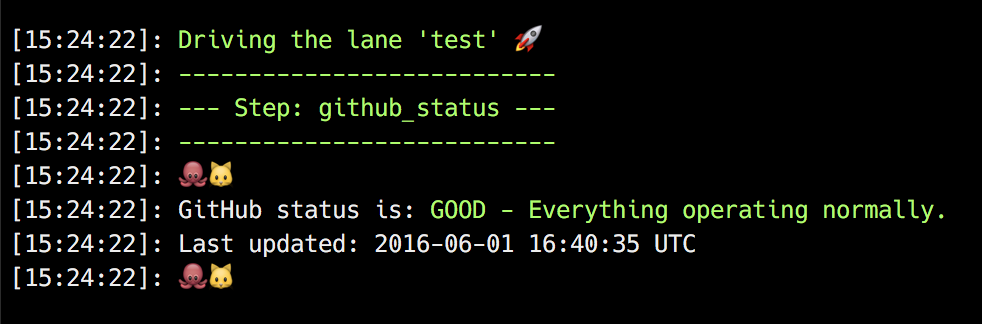

# github_status plugin

[](https://rubygems.org/gems/fastlane-plugin-github_status)

## Getting Started

This project is a [fastlane](https://github.com/fastlane/fastlane) plugin. To get started with fastlane-plugin-github_status, add it to your project by running:

```bash
fastlane add_plugin github_status
```

## About github_status

Provides the ability to display and act upon GitHub server status as part of your build

```ruby
	# Display the status of the GitHub APIs as part of your build
	github_status
```




```ruby
	# Stop the build if the status of the GitHub APIs is currently at or above a certain level of trouble
	github_status(abort_level: 'major') # 'minor' or 'major'
```

If you want to see how your build will behave when GitHub returns a particular status, you can temporarily force the plugin to return a particular status value by setting the `GITHUB_STATUS_TEST_STATUS` environment variable before your run, like:

```bash
GITHUB_STATUS_TEST_STATUS=major fastlane your_lane
```

```ruby
	# Capture the GitHub APIs status information, and use it however you'd like
	message = github_status
	puts "✅ #{message.body} ✅" if message.status == 'good'
```

## Example

Check out the [example `Fastfile`](fastlane/Fastfile) to see how to use this plugin. Try it by cloning the repo, running `fastlane install_plugins` and `bundle exec fastlane test`.

## Run tests for this plugin

To run both the tests, and code style validation, run

````
rake
```

To automatically fix many of the styling issues, use
```
rubocop -a
```

## Issues and Feedback

For any other issues and feedback about this plugin, please submit it to this repository.

## Troubleshooting

If you have trouble using plugins, check out the [Plugins Troubleshooting](https://github.com/fastlane/fastlane/blob/master/fastlane/docs/PluginsTroubleshooting.md) doc in the main `fastlane` repo.

## Using `fastlane` Plugins

For more information about how the `fastlane` plugin system works, check out the [Plugins documentation](https://github.com/fastlane/fastlane/blob/master/fastlane/docs/Plugins.md).

## About `fastlane`

`fastlane` is the easiest way to automate building and releasing your iOS and Android apps. To learn more, check out [fastlane.tools](https://fastlane.tools).
